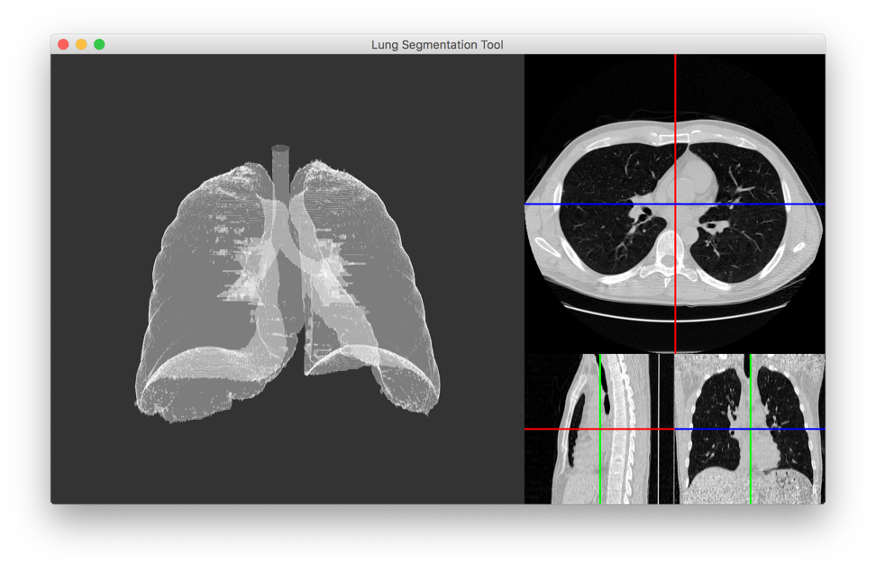

# Lung Segmentation Tool

This package contains scripts to perform lung segmentation on a CT scan. These have been combined into a simple visualisation tool that can be used to inspect CT scans using OpenGL.

The segmentation functions are based on a traditional CV-based algorithm, described in the [Kaggle DSB 2017 Tutorial](https://www.kaggle.com/c/data-science-bowl-2017#tutorial).

## Requirements

This package requires Python 3.

To get the source code and install dependencies:

    git clone git@github.com:tristanpenman/lung-segmentation-tool.git
    cd lung-segmentation-tool
    pip install -r requirements.txt

You may also choose to install the package on your system:

    pip install .

## Usage

Included in this package is a visualisation tool called `lung-segmentation-tool`. This can be used to load CT scans in MetaImage (.mhd) and DICOM (.dcm) format.

You can launch the visualisation tool from the command line, using options that configure the step size of the generated mesh:

    lung-segmentation-tool \
        --scan-path ${PATH_TO_SCAN} \
        --step-size 1

Choosing a larger step size will shorten the time taken to generate a mesh, but will result in lower detail.

If you have cloned the git repository but not installed the package, you should still be able to run the visualisation tool locally:

    ./bin/lung-segmentation-tool \
        --scan-path ${PATH_TO_SCAN} \
        --step-size 1

## Example

An example CT scan is included in the [data](./data) directory. CT scans tend to be quite large, so this scan has been compressed using `xz`. Before using this scan, you'll need to decompress it:

    cd data
    tar xvf 1.3.6.1.4.1.14519.5.2.1.6279.6001.219909753224298157409438012179.tar.xz
    cd ..

Now you can run it through the visualisation tool:

    ./bin/lung-segmentation-tool \
        --scan-path data/1.3.6.1.4.1.14519.5.2.1.6279.6001.219909753224298157409438012179.mhd \
        --step-size 1

## Screenshot

Successfully loading and segmenting a CT scan will look something like this:

On the left is the segmentation view. You can rotate and zoom using the left-mouse button and scroll-wheel.

On the top-right is the transverse view.

Below that are two views. On the left is the sagittal view, and on the right is the frontal view.

Clicking and dragging on the transverse view will change slices shown on the views below it.

## Known issues and limitations

Interaction with the transverse, sagittal and frontal views is limited.

Currently only the transverse view will respond to mouse events, changing the slices in the sagittal and frontal views to be centered at the location that is selected.

The sagittal and frontal views do not respond to mouse events at all.

My aim is to add planes to the 3D segmented view, to show exactly which location in the scan has been selected via the 2D views.

## License

This code is licensed under the MIT License.

See the LICENSE file for more information.
